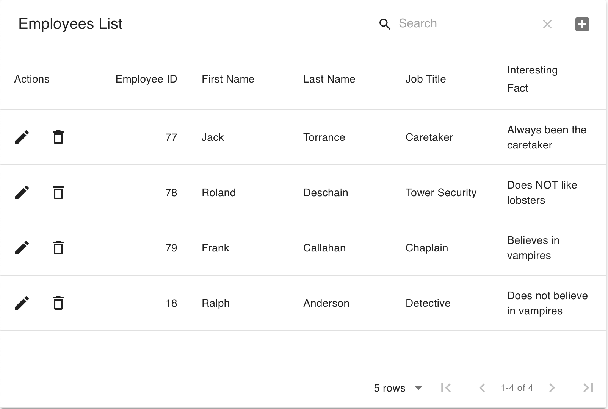

# Employee-Directory
An employee directory application using React.js tools and fundamentals. 

The purpose of this project was to build an application with React.js that would allow users to view an employee directory and sort/filter the directory table. The project user story is below

==========

AS A manager

I WANT to be able to view my entire employee directory at once 

SO THAT I have quick access to their information.

==========

The criteria for a successful project are below:

* Application should allow users to sort the table by at least one category.

* Application should allow users to filter the employees by at least one property.

## Getting Started
The deployed project should look like this.

Deployed Project

Below is the link to the project repository and a link to the deployed application on Heroku.

https://github.com/jcw2865/Employee-Directory

https://gentle-hollows-02769.herokuapp.com/

Development
Below are the steps I took to create the application as it is so far. This was my first project utilizing React.js. There was definitely a learning curve around JSX and understanding how React components work. 

* Created the initial React app with the CLI command "npx create-react-app".

* Downloaded all dependecies using npm.

* Verified base functionality of app by running it locally on port 3000.

* Created three components: Wrapper, Table, and Footer. The Table component was built using Material-UI. 

* Verified local functionality of application. 

* Created application with Heroku.

* Troubleshoot the deployment to Heroku. Issues arose with Heroku deployment where I initially named the Table js file as "table.js", but was only referencing the Table folder. As a result, I changed the name of the Table js file to "index.js" and deployment was successful.

## Testing
This application was not developed using Test Driven Development. However, at numerous points throughout development, Postman and console.log's were used to test the results of new elements.

## Deployment
This program can be viewed and deployed using most internet browsers via the links in the "Getting Started" section.

## Built With

* [VSCode](https://code.visualstudio.com/) - The platform I used for developing this project.
* [MDN](https://developer.mozilla.org/en-US/) - Used as a reference tool.
* [GoogleChrome](https://www.google.com/chrome/) - Used for inspector tool and validating the program during development. 
* [Node.js](https://nodejs.org/en/) - Used to execute JS code outside of a web browser.
* [NodePackageManager](https://www.npmjs.com/) - Used to install node modules/dependencies
* [React.js](https://reactjs.org) - A JavaScript library for building user interfaces.
* [MaterialUI](https://material-ui.com/) - Used to create the Table. 
<!-- ## Contributing

Please read [CONTRIBUTING.md](https://gist.github.com/PurpleBooth/b24679402957c63ec426) for details on our code of conduct, and the process for submitting pull requests to us. -->

## Authors

* **Jake Walker** - [jcw2865](https://github.com/jcw2865)

<!-- See also the list of [contributors](https://github.com/your/project/contributors) who participated in this project. -->

<!-- ## License

This project is licensed under the MIT License - see the [LICENSE.md](LICENSE.md) file for details -->

## Acknowledgments

* The advisors, instructors, and TAs at the Coding Bootcamp at the University of Texas at Austin
* Tutoring staff at Trilogy
* Fellow classmates at the Coding Bootcamp at UT-Austin
* Friends in the industry